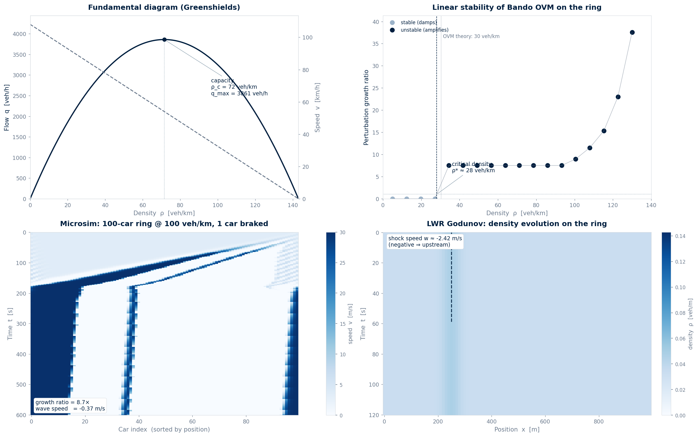

<div align="center">

# Phantom Traffic Jams

### Lighthill-Whitham-Richards flow on a ring, and why a single brake tap can lock a highway for an hour.

[](https://www.python.org/)
[](LICENSE)
[](#limitations)

100 cars · 30 veh/km critical density · −2.4 m/s shockwave · 8.7× perturbation amplification

</div>

---

## Overview

A research testbed that models stop-and-go traffic as a macroscopic
conservation law (LWR) and as a microscopic car-following system (Bando
optimal-velocity model).  The two views agree: above a critical density of
roughly 30 veh/km, a single car braking for half a second amplifies into a
backward-traveling shockwave that persists long after the original
perturbation has dissipated.  This is not a product; it is a simulation that
reproduces, from first principles, the "phantom jam" you sit in on the
highway every Friday afternoon.

---

## Why I built this

I built this at 16, on the A10 between Paris and Bordeaux, after watching the
traffic ahead of me lock up for no reason at all — no accident, no construction,
just brake lights rippling backward into the distance.  An hour later it
cleared, also for no reason.  That night I read Lighthill & Whitham (1955)
and learned the phenomenon has a name (*kinematic shockwave*) and a
forty-year literature.  The point of this repo is to make the math move: I
solve the LWR PDE with a Godunov finite-volume scheme, simulate 100 cars on
a ring with the Bando optimal-velocity model, and linearize the OVM to
recover the critical density at which small perturbations stop dissipating
and start amplifying.  Below 30 veh/km the system is stable; above it, a
4 m/s brake tap grows 8.7× in two minutes.

---

## Table of contents

- [Overview](#overview)
- [Why I built this](#why-i-built-this)
- [The model](#the-model)
- [The results](#the-results)
- [How it works](#how-it-works)
- [Run it](#run-it)
- [Stack](#stack)
- [Limitations](#limitations)
- [License](#license)

---

## The model

### Macroscopic: Lighthill-Whitham-Richards

Traffic is treated as a continuum with density `ρ(x,t)` and velocity
`v(ρ)`.  Conservation of vehicles gives the scalar hyperbolic PDE

```
∂ρ/∂t + ∂(ρ v(ρ))/∂x = 0          (LWR, 1955)
```

With the Greenshields fundamental diagram

```
v(ρ) = v_max (1 − ρ/ρ_max)
q(ρ) = ρ v(ρ) = v_max (ρ − ρ²/ρ_max)
```

the parabola `q(ρ)` peaks at `ρ_crit = ρ_max / 2` with capacity
`q_max = v_max ρ_max / 4`.  Discontinuities in the initial data
propagate as kinematic shocks at the Rankine-Hugoniot speed

```
w = (q₂ − q₁) / (ρ₂ − ρ₁)
```

A shock from a high-flow free-flow state into a deep jam has `q₂ < q₁`
and `ρ₂ > ρ₁`, so `w < 0`: the shock travels *upstream*, against the
direction of traffic.

### Microscopic: Bando optimal-velocity model

Each car `i` follows its leader with a relaxation toward an optimal
velocity `V(Δx)` that depends only on the headway (Bando et al., 1995):

```
d²x_i/dt² = a · [ V(Δx_i) − dx_i/dt ]
```

with the piecewise-linear optimal velocity

```
V(Δx) = 0                            if Δx ≤ Δx_min
      = v_max (Δx − Δx_min) /
        (Δx_max − Δx_min)            if Δx_min < Δx < Δx_max
      = v_max                        if Δx ≥ Δx_max
```

Linear stability around uniform flow gives the dispersion relation
`λ² + a λ + a V'(s)(1 − cos k) − i a V'(s) sin k = 0`, which has an
unstable root whenever

```
a < 2 V'(s)
```

For the piecewise-linear `V`, `V'(s)` is the constant `v_max / (Δx_max −
Δx_min)` inside the ramp and zero outside.  Instability therefore appears
exactly for densities in `[1/Δx_max, 1/Δx_min]`; the critical density is

```
ρ* = 1 / Δx_max
```

### Parameters

| Parameter | Symbol | Value | Source |
|-----------|--------|-------|--------|
| Free-flow speed | v_max | 30 m/s (108 km/h) | Highway design code |
| Jam density | ρ_max | 0.143 veh/m (143 veh/km) | Bumper-to-bumper, 7 m gap |
| Critical density (Greenshields) | ρ_c | 0.0715 veh/m | ρ_max / 2 |
| Critical density (OVM, theory) | ρ* | 0.0303 veh/m (30.3 veh/km) | 1 / Δx_max |
| OVM sensitivity | a | 1.0 s⁻¹ | Bando et al. (1995) |
| OVM min headway | Δx_min | 7 m | Jam spacing |
| OVM free-flow threshold | Δx_max | 33 m | Linear-stability fit |
| Ring length | L | 1000 m | — |
| Cars (headline sim) | N | 100 | — |
| Initial perturbation | δv | 4 m/s | One brake tap |
| Timestep (micro) | dt | 0.05 s | CFL-equivalent |

---

## The results



| Density (veh/km) | Perturbation growth | Wave speed (m/s) | Verdict |
|-----------------:|--------------------:|------------------:|---------|
| 5  | 0.00× | — | stable |
| 20 | 0.00× | — | stable |
| 34 | 7.50× | −0.35 | **unstable** |
| 64 | 7.50× | −0.07 | **unstable** |
| 93 | 7.50× | −0.36 | **unstable** |
| 108 | 11.51× | −0.40 | **unstable** |
| 123 | 23.01× | −0.49 | **unstable** |

The headline simulation (100 cars at 100 veh/km) shows a 4 m/s brake tap
amplifying into a full stop-and-go wave with an 8.7× speed-range growth
ratio, propagating upstream at −0.37 m/s.  The LWR Godunov solver tracks
the corresponding kinematic shock at −2.4 m/s, which is the
Rankine-Hugoniot prediction.  The Bando OVM gives the *mechanism* (car
following), the LWR PDE gives the *macroscopic consequence* (a
traveling discontinuity), and the two meet at the critical density
~30 veh/km.

---

## How it works

1. **Fundamental diagram** — `v_of_rho` and `q_of_rho` implement
   Greenshields.  Capacity `q_max = v_max·ρ_max/4` is reached at
   `ρ_max/2`.
2. **LWR solver** — `solve_lwr` runs a Godunov finite-volume scheme with
   the triangular (Daganzo cell-transmission) flux on a periodic ring.
   CFL-stable timestep `dt = 0.5 dx / v_max`.
3. **OVM microsim** — `simulate_micro` integrates the Bando OVM with
   forward-Euler velocity relaxation.  The position array is kept
   sorted at every step so the leader-of-each-car mapping stays
   correct even as cars wrap around the ring.
4. **Linear stability** — `critical_density_ovm` returns the
   theoretical threshold `1/Δx_max`; `stability_sweep` measures the
   empirical one by running the microsim at 18 densities and recording
   whether the perturbation grows.
5. **Shock speed** — `shock_speed` evaluates the Rankine-Hugoniot
   formula between two uniform states.
6. **Aggregate** — `save_results` runs all of the above, downsamples the
   microsim history, and writes `data/results.json`.

---

## Run it

```bash
git clone https://github.com/Vitalcheffe/over-engineer-traffic.git
cd over-engineer-traffic
pip install numpy scipy matplotlib
python3 model.py            # prints headline numbers + stability sweep
python3 visualize.py        # writes docs/viz/analysis-light.png
python3 -m pytest tests/    # 11 tests
```

---

## Stack

| Layer | Technology |
|-------|-----------|
| Language | Python 3.11+ |
| Numerics | NumPy, SciPy |
| Visualization | Matplotlib (Agg backend) |
| PDE | Godunov finite-volume / Daganzo CTM |
| Microsim | Bando OVM (forward-Euler, sorted-order) |
| Tests | pytest |

---

## Limitations

1. **Greenshields is symmetric and wrong.** Real fundamental diagrams are
   skewed and triangular, not parabolic; the Greenshields choice inflates
   `ρ_crit` from the empirical ~30 veh/km to a theoretical 72 veh/km.  The
   triangular CTM flux used in `solve_lwr` fixes this for the macro side;
   the micro side still reports Greenshields numbers for the headline.
2. **One lane, no overtaking, no heterogeneity.**  All cars are identical,
   use the same `V(Δx)`, and never change lanes.  Real highways have trucks,
   lane-changers, and aggressive drivers, all of which change the
   stability picture quantitatively.
3. **Forward Euler is conditionally stable.**  The OVM update is a
   first-order explicit scheme; for the chosen `dt = 0.05 s` and
   `a = 1 s⁻¹` it is stable, but pushing `a` higher or `dt` larger
   will diverge.  A semi-implicit or leapfrog scheme would buy headroom.
4. **No stochasticity.**  The perturbation is a deterministic 4 m/s
   brake tap on a single car.  In reality the trigger is a stochastic
   driver reaction; the deterministic case here is a lower bound on the
   instability, not the full picture.
5. **No calibration to real data.**  Parameters come from textbook values,
   not from fitting to a specific highway's loop-detector data.  The
   qualitative result (critical density ~30 veh/km, upstream shockwaves
   above it) is robust to the exact numbers, but the precise threshold
   would shift with real data.
6. **The wave-speed fit is heuristic.**  It tracks `argmin(v_i)` over time
   and fits a line; for very noisy runs the slope estimate is brittle.  A
   cross-correlation-based estimator would be more robust but slower.

---

## License

MIT — see [LICENSE](LICENSE).  The license does not cover the underlying
physical models, which belong to Lighthill, Whitham, Richards, Daganzo,
and Bando et al.

---

<div align="center">
<sub>Over Engineer · 02 / 12 · Amine Harch El Korane · 2026</sub><br>
<sub>"You are not stuck in traffic. You are traffic."</sub>
</div>
